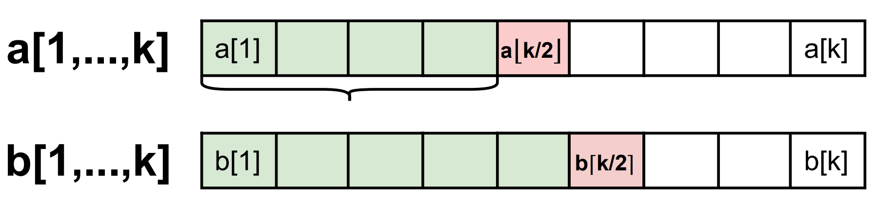

# 0004. Median of Two Sorted Arrays

The run time requirement is $O(log (m+n))$, which is why this question is classified as *`Hard`*.

## Method 1
The first method I tried was to merge the two arrays and then find their median. This gives a run time of $O(m+n)$, which doesn't meet the requirement, but it does solve the problem and may help us develop an idea for the optimal solution later.

The challenging part is to deal with the edge cases. For example, double check the indexes of arrays before accessing the elements, just in case the indexes are out of bounds.

If each element is accessed once, the run time becomes $O(m+n)$.

Supposed we have two sorted arrays:
* $X=(x_1, x_2, ...,x_m)$
* $Y=(y_1, y_2, ...,y_n)$

A longer sorted array that is a combination of $X$ and $Y$, i.e. $Z=(z_1, z_2,..., z_k) = merge(X,Y)$ ,(k=m+n)

* Case 1: $x_m \ge y_n$ **Then** $z_k=x_m$

    and $(z_1, z_2,..., z_{k-1}) = merge((x_1, x_2, ...,x_{m-1}), (y_1, y_2, ...,y_n))$

* Case 2: $x_m < y_n$ **Then** $z_k=y_n$

    and $(z_1, z_2,..., z_{k-1}) = merge((x_1, x_2, ...,x_m), (y_1, y_2, ...,y_{n-1}))$

## Method 2
This method is similar to a Binary search.

Suppose we are looking for the $k$ th smallest element $s_k$ in the union of two sorted arrays $a[1,...,m]$ and $b[1,...,n]$.

Since we are searching for the $k$ th smallest element, we can focus on the shrinking arrays $a[1,...,k]$ and $b[1,...,k]$. If $k > m$ or $k > n$, we can fill those elements with index larger than the array boundary with infinite value.

* Case 1 (Base case): if $a[⌊k/2⌋] = b[⌈k/2⌉]$, then $s_k = a[⌊k/2⌋] = b[⌈k/2⌉]$

* Case 2: Assume $a[⌊k/2⌋] > b[⌈k/2⌉]$, then in the union of $a[1,...,k]$ and $b[1,...,k]$, there can be at most $k-2$ elements smaller than or equal to $b[⌈k/2⌉]$, i.e. $a[1,...,⌊k/2⌋-1]$ and $b[1,...,⌈k/2⌉-1]$. Hence we have $s_k > b[⌈k/2⌉]$

 
* Case 3:

References: SanjoyDasgupta, Christos H. Papadimitriou and Umesh Vazirani. Algorithms. McGraw Hill Education, 2006 (Solution 2.22) .