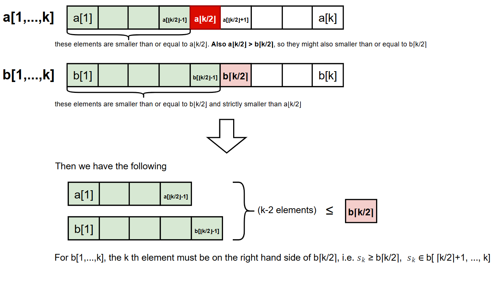
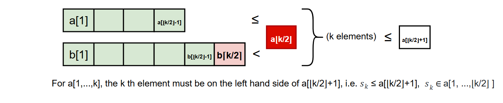
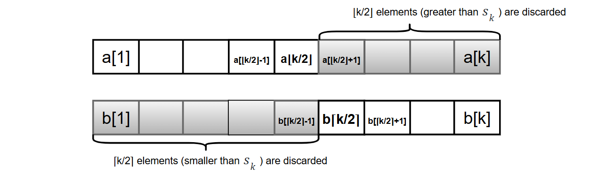

# 0004. Median of Two Sorted Arrays

The run time requirement is $O(log (m+n))$, which is why this question is classified as *`Hard`*.

## Method 1
The first method I tried was to merge the two arrays and then find their median. This gives a run time of $O(m+n)$, **which doesn't meet the requirement, but it does solve the problem (solution accepted by LeetCode)** and may help us develop an idea for the optimal solution later.

The challenging part is to deal with the edge cases. For example, double check the indexes of arrays before accessing the elements, just in case the indexes are out of bounds.

If each element is accessed once, the run time becomes $O(m+n)$.

Supposed we have two sorted arrays:
* $X=(x_1, x_2, ...,x_m)$
* $Y=(y_1, y_2, ...,y_n)$

A longer sorted array that is a combination of $X$ and $Y$, i.e. $Z=(z_1, z_2,..., z_k) = merge(X,Y)$ ,(k=m+n)

* Case 1: $x_m \ge y_n$ **Then** $z_k=x_m$

    and $(z_1, z_2,..., z_{k-1}) = merge((x_1, x_2, ...,x_{m-1}), (y_1, y_2, ...,y_n))$

* Case 2: $x_m < y_n$ **Then** $z_k=y_n$

    and $(z_1, z_2,..., z_{k-1}) = merge((x_1, x_2, ...,x_m), (y_1, y_2, ...,y_{n-1}))$

## Method 2
This method is similar to a Binary search.

Suppose we are looking for the $k$ th smallest element $s_k$ in the union of two sorted arrays $a[1,...,m]$ and $b[1,...,n]$.

Since we are searching for the $k$ th smallest element, we can focus on the shrinking arrays $a[1,...,k]$ and $b[1,...,k]$. If $k > m$ or $k > n$, we can fill those elements with index larger than the array boundary with infinite value.

* Case 1 (Base case): if $a[⌊k/2⌋] = b[⌈k/2⌉]$, then $s_k = a[⌊k/2⌋] = b[⌈k/2⌉]$

* Case 2: Assume $a[⌊k/2⌋] > b[⌈k/2⌉]$, then in the union of $a[1,...,k]$ and $b[1,...,k]$, there can be at most $k-2$ elements smaller than or equal to $b[⌈k/2⌉]$, i.e. $a[1,...,⌊k/2⌋-1]$ and $b[1,...,⌈k/2⌉-1]$ are smaller than or equal to $b[⌈k/2⌉]$. Hence, for array $b[1,...,k],$ we have $s_k ≥ b[⌈k/2⌉]$

    

    Similarly, there are $k$ elements smaller than or equal to $a[⌊k/2⌋+1]$, i.e. $a[1,...,⌊k/2⌋]$ and $b[1,...,⌈k/2⌉]$ are smaller than or equal to $a[⌊k/2⌋+1]$.
    
    So, fo array $a[1,...,k]$, we have $s_k ≤ a[⌊k/2⌋+1]$, and $s_k$ must be contained in the union of the subarrays $a[1,...,⌊k/2⌋]$ and $b[⌈k/2⌉+1,...,k]$
    
    

    Since we discarded $⌈k/2⌉$ elements smaller than $s_k$, $s_k$ will be the $⌊k/2⌋ \text{th}$ smallest element in this union. We can then find $s_k$ by recursing on this smaller problem.

    

* Case 3: Assume $a[⌊k/2⌋] < b[⌈k/2⌉]$, this is symmetric with case 2.

### Running Time Analysis
Initially we restrict our attention to $a[1,...,k]$ and $b[1,...,k]$, so the size of the union we consider is ≤ $2K$. At every step we halve the number of elements, and does one comparison (between $a[⌊k/2⌋]$ and  $b[⌈k/2⌉]$).

Let $n=2k$, and $T(n)$ be the running time of this algorithm on an input of n (or 2k) elements. Assuming the comparison takes constant time, we have:

$$
\begin{align*}
T(n) &= T(n/2) + c \\
&= T(n/2^2) + 2c \\
&= T(n/2^3) + 3c \\
&= \cdots \\
&= T(n/2^t) + tc \text{ (after t times)} \\
\end{align*}
$$

The algorithm will terminate when the problem size reaches the base case, say $T(1)$, which also compares $a[⌊k/2⌋]$ and $b[⌈k/2⌉]$, then $T(n/2^t) = T(1) = c$, and $$1=\frac{n}{2^t} \Rightarrow 2^t=n \Rightarrow t=\text{log}_2 n$$

Substitute $t=\text{log}_2 n$ into $T(n) = T(n/2^t) + tc$

Finally, 

$$
\begin{align*}
T(n) &= T(1) + c (\text{log}_2 n) \\
&= c + c (\text{log}_2 2k) \text{ (since n=2k)} \\
&= c + c(\text{log}_2 2 + \text{log}_2 k) \\
&= c + c(1 + \text{log}_2 k) \\
&= 2c + c (\text{log}_2 k)
\end{align*}
$$

Hence, $T(n) = O(\text{log } k)$, which is $O(\text{log}(m+n))$, as we must have $k≤m+n$ for the $k\text{th}$ smallest element to exist.

## References

SanjoyDasgupta, Christos H. Papadimitriou and Umesh Vazirani. Algorithms. McGraw Hill Education, 2006 (Solution 2.22) .